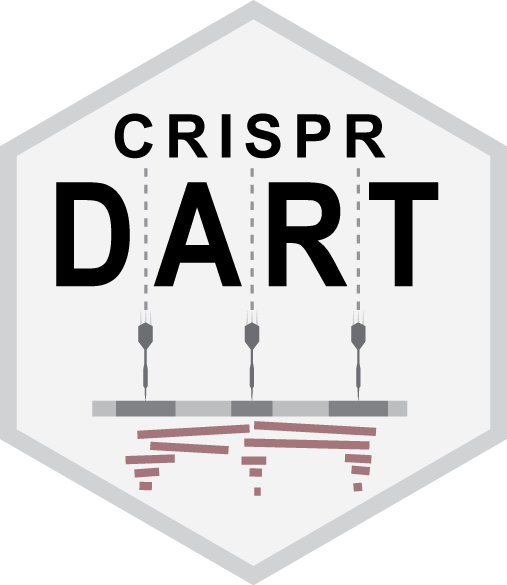
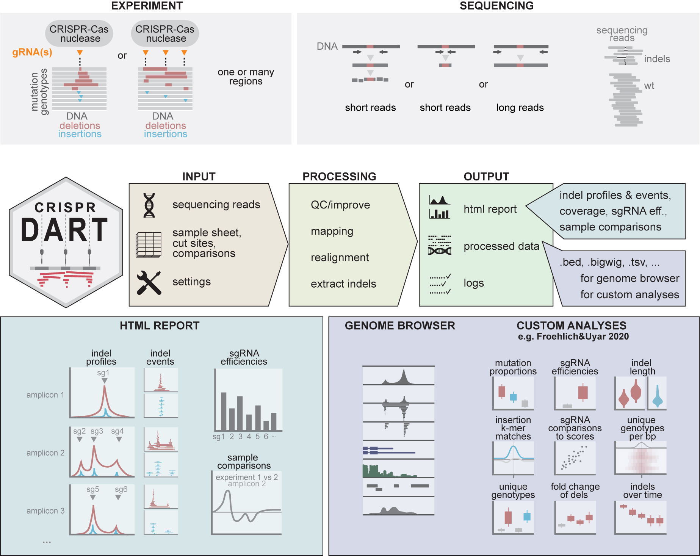
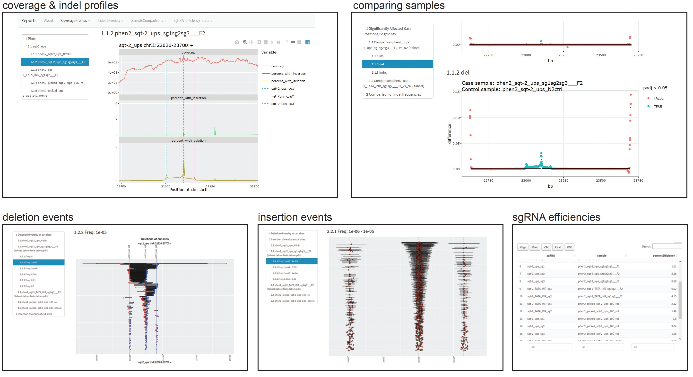

<p align="center">
  
</p>

# crispr-DART (Downstream Analysis and Reporting Tool)

crispr-DART is a pipeline to process, analyse, and report about the 
CRISPR-Cas9 induced genome editing outcomes from high-throughput sequencing
of target regions of interest. 

crispr-DART has been developed as part of the study "Parallel genetics of 
regulatory sequences using scalable genome editing in vivo" and is now 
published at Cell Reports: 
[Froehlich, J. & Uyar, B. *et al*, Cell Reports, 2021](https://www.cell.com/cell-reports/fulltext/S2211-1247(21)00302-8).

Here is also the news coverage of our story: 
[Scaling up genome editing big in tiny worms](https://www.mdc-berlin.de/news/press/crispr-dart-genomes-worms-edit-track). 

## Pipeline scheme

The pipeline allows single/paired-end Illumina reads or long PacBio reads from 
both DNA and RNA samples. 

The pipeline consists of the following steps:
- Quality control (fastqc/multiqc) and improvement (TrimGalore!) of raw reads 
- Mapping the reads to the genome of interest (BBMap)
- Extracting statistics about the detected insertions and deletions
(various R libraries including GenomicAlignments and RSamtools)
- Reporting of the editing outcomes in interactive reports organized into a 
website. (rmarkdown::render_site) 

 


## Example HTML report output

The HTML reports produced by the pipeline are automatically organised as a website. 
Example report website can be browsed [here](https://bimsbstatic.mdc-berlin.de/akalin/buyar/froehlich_uyar_et_al_2020/reports/index.html): 

## Example screenshots from the reports

You can find below some example screenshots from the HTML reports:




# Installation

1. Download the source code:

```
> git clone https://github.com/BIMSBbioinfo/crispr_DART.git
```

2. Create a guix profile with dependencies

```
> mkdir -p $HOME/guix-profiles/crispr_dart
> guix package --manifest=guix.scm --profile=$HOME/guix-profiles/crispr_dart

# activate env
> source ~/guix-profiles/crispr_dart/etc/profile
```

3. Test the installation on sample data

```
> snakemake -s snakefile.py --configfile sample_data/settings.yaml --cores 4 --printshellcmds
```

# How to run the pipeline 

## Preparing the input files

The pipeline currently requires four different input files. 
1. A sample sheet file, which describes the samples, associated fastq files, the sets of sgRNAs used in the sample and the list of regions of interest. 

Please see the example sample sheet file under `sample_data/sample_sheet.csv`. 

2. A BED file containing the genomic coordinates of all the sgRNAs used in this project. 

Please see the example BED file for sgRNA target sites under `sample_data/cut_sites.bed`

3. A comparisons table, which is used for comparing pairs of samples in terms of genome editing outcomes. 

Please see the example table under `sample_data/comparisons.tsv`

4. A settings file, which combines all the information from the other input files and additional configurations for resource requirements of tools. 

Please see the example file under `sample_data/settings.yaml`

The `sample_data/fasta` folder contains fasta format sequence files that are used as the target genome sequence. 
The `sample_data/reads` folder contains sample read files (fastq.gz files from Illumina and PacBio sequenced samples). 

## Running the pipeline

Once the `settings.yaml` file is configured with paths to all the other required files, the pipeline can simply be run using the bash script `run.sh` requesting 2 cpus. 

```
> snakemake -s snakefile.py --configfile */path/to/settings.yaml* --cores 4 --printshellcmds
```

If you would like to do a dry-run, meaning that the list of jobs are created but not executed, you can do 

```
> snakemake -s snakefile.py --configfile */path/to/settings.yaml* --cores 4 --dryrun --printshellcmds
```

# How to cite

See the publication on [Cell Reports](https://www.cell.com/cell-reports/pdf/S2211-1247(21)00302-8.pdf)

# Credits

The software has been developed by [Bora Uyar](https://scholar.google.com/citations?user=YEZr1LUAAAAJ&hl=en) from the [Akalin Lab](https://bioinformatics.mdc-berlin.de) with significant conceptual contributions by [Jonathan Froehlich](https://scholar.google.com/citations?user=aXWiWfcAAAAJ&hl=en) from the [N.Rajewsky Lab](https://www.mdc-berlin.de/n-rajewsky) at the Berlin Institute of Medical Systems Biology of the Max-Delbruck-Center for Molecular Medicine. 

